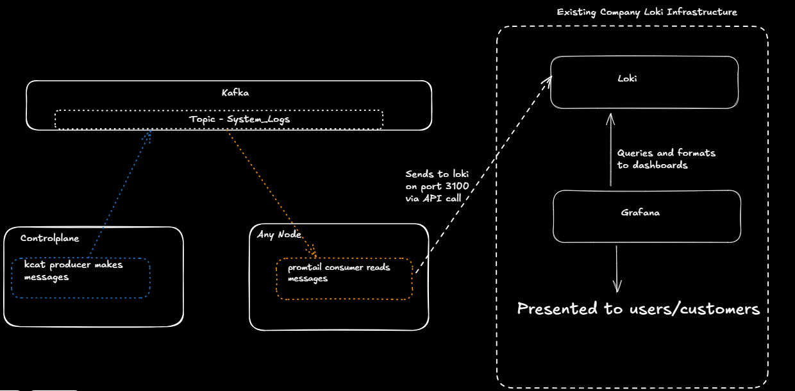

Your team is going to be integrating an Apache Kafka message bus with existing infrastructure. You are setting up a new environment to facilitate the deployment. 

Examine the proposed architecture and deploy these components for this lab.



Your team has determined they need to offload and monitor Linux logs in your environment. You know that Grafana can do that as a visualization tool, so you plan to deploy it on a server as a daemon.

Deploy Grafana and ensure that it is running on your server.

<br>

### Solution
<details>
<summary>Solution</summary>
  
Refer to the [Grafana Docs](https://grafana.com/docs/grafana/latest/setup-grafana/installation/) for latest installation instructions.

Install the required packages and Grafana GPG key.

```plain
apt install -y apt-transport-https
```{{exec}}

```plain
apt install -y software-properties-common wget
```{{exec}}

```plain
sudo wget -q -O /usr/share/keyrings/grafana.key https://apt.grafana.com/gpg.key
```{{exec}}

Add the Grafana repository.
  
```plain
echo "deb [signed-by=/usr/share/keyrings/grafana.key] https://apt.grafana.com stable main" | sudo tee -a /etc/apt/sources.list.d/grafana.list
```{{exec}}
  
Finally, we're ready to install Grafana:
  
```plain
apt update
# Install the latest Enterprise release:
apt install -y grafana-enterprise
```{{exec}}

Now that you've installed Grafana, let's make sure it's started.

```plain
systemctl daemon-reload
```{{exec}}

```plain
systemctl start grafana-server
```{{exec}}

```plain
systemctl status grafana-server --no-pager
```{{exec}}

Verify that the server is serving on port 3000 (the default port)

```plain
systemctl status grafana-server --no-pager
ss -ntulp | grep grafana
ss -ntulp | grep 3000
```{{exec}}

We can also check that the external Web UI is available and change the default password.

{{TRAFFIC_HOST1_3000}}

Change the password. Default User: admin and Password: admin

Feel free to look around in the Web UI and then continue on to the next part of the lab.

</details>
