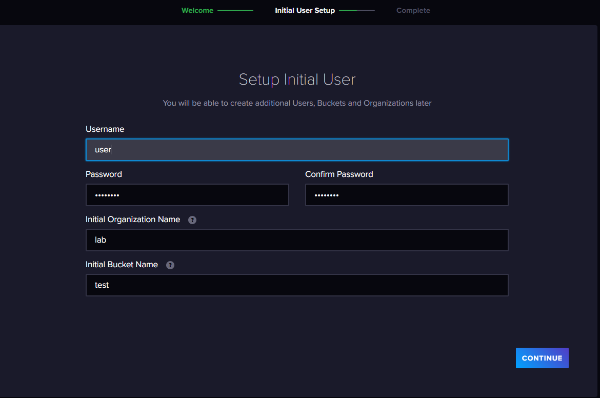

Install Telegraf, influxdb, and Grafana on the system.

<br>

### Solution
<details>
<summary>Solution</summary>

Install the required packages and Grafana GPG key.

```plain
apt install -y apt-transport-https
```{{exec}}

```plain
apt install -y software-properties-common wget
```{{exec}}

```plain
sudo wget -q -O /usr/share/keyrings/grafana.key https://apt.grafana.com/gpg.key
```{{exec}}

Add the Grafana repository.
  
```plain
echo "deb [signed-by=/usr/share/keyrings/grafana.key] https://apt.grafana.com stable main" | sudo tee -a /etc/apt/sources.list.d/grafana.list
```{{exec}}
  
Finally, we're ready to install Grafana:
  
```plain
apt update
# Install the latest Enterprise release:
apt install -y grafana-enterprise
```{{exec}}

Now that you've installed Grafana, let's make sure it's started.

```plain
systemctl daemon-reload
```{{exec}}

```plain
systemctl start grafana-server
```{{exec}}

```plain
systemctl status grafana-server --no-pager
```{{exec}}

Verify that the server is serving on port 3000 (the default port). This may take up to 10 seconds to come back with the correct listening port.

```plain
systemctl status grafana-server --no-pager
ss -ntulp | grep grafana
ss -ntulp | grep 3000
```{{exec}}

We can also check that the external Web UI is available and change the default password.

{{TRAFFIC_HOST1_3000}}

Change the password. Default User: admin and Password: admin

Feel free to look around in the Web UI and then continue on to the next part of the lab.

Install the InfluxDB2 repository.

```plain
wget -q https://repos.influxdata.com/influxdata-archive_compat.key
echo '393e8779c89ac8d958f81f942f9ad7fb82a25e133faddaf92e15b16e6ac9ce4c influxdata-archive_compat.key' | sha256sum -c && cat influxdata-archive_compat.key | gpg --dearmor | tee /etc/apt/trusted.gpg.d/influxdata-archive_compat.gpg > /dev/null
echo 'deb [signed-by=/etc/apt/trusted.gpg.d/influxdata-archive_compat.gpg] https://repos.influxdata.com/debian stable main' | tee /etc/apt/sources.list.d/influxdata.list
```{{exec}}

Install InfluxDB2

```plain
apt-get update && apt-get -y install influxdb2
```{{exec}}

Start InfluxDB2

```plain
systemctl start influxdb      
systemctl enable influxdb
```{{exec}}

Verify InfluxDB2 is listening on the correct port.

```plain
ss -ntulp | grep 8086
lsof -i :8086
```{{exec}}

Connect to InfluxDB, set up your organization, bucket, and token. Copy those pieces of information out to a notepad, you will need them shortly.

{{TRAFFIC_HOST1_8086}}



Once this is complete you have completed this section of the lab.

Install the respository for telegraf.

```plain
wget -q https://repos.influxdata.com/influxdata-archive_compat.key
echo '393e8779c89ac8d958f81f942f9ad7fb82a25e133faddaf92e15b16e6ac9ce4c influxdata-archive_compat.key' | sha256sum -c && cat influxdata-archive_compat.key | gpg --dearmor | tee /etc/apt/trusted.gpg.d/influxdata-archive_compat.gpg > /dev/null
echo 'deb [signed-by=/etc/apt/trusted.gpg.d/influxdata-archive_compat.gpg] https://repos.influxdata.com/debian stable main' | tee /etc/apt/sources.list.d/influxdata.list
```{{exec}}

Install telegraf

```plain
apt update && apt -y install telegraf
```{{exec}}

Setup the telegraf configuration file to write to the output producer for influxdb2

```plain
vi /etc/telegraf/telegraf.conf
```{{exec}}

Set the information as follows: (Replace with your url, token, organization, and bucket)
```plain
###############################################################################
#                            OUTPUT PLUGINS                                   #
###############################################################################


# # Configuration for sending metrics to InfluxDB 2.0
 [[outputs.influxdb_v2]]
#   ## The URLs of the InfluxDB cluster nodes.
#   ##
#   ## Multiple URLs can be specified for a single cluster, only ONE of the
#   ## urls will be written to each interval.
#   ##   ex: urls = ["https://us-west-2-1.aws.cloud2.influxdata.com"]
   urls = ["http://127.0.0.1:8086"]
#
#   ## Token for authentication.
   token = "mXA4HiqkssvKaNMtGmEyGPa7h8bpV7hwgjqRJKtBz79qpbQSbIzsaClRJgyuIhBxyw5Lb8qF2Jt1yy_-2qUTA=="
#
#   ## Organization is the name of the organization you wish to write to.
   organization = "lab"
#
#   ## Destination bucket to write into.
   bucket = "test"
```

Also fix the section on telegraf so that it can read fail2ban information:

```plain
# # Read metrics from fail2ban.
 [[inputs.fail2ban]]
#   ## Use sudo to run fail2ban-client
   use_sudo = true 
```

Give the fail2ban user sudo permissions to read from the client.

```plain
vi /etc/sudoers.d/telegraf
```{{exec}}

Add the following three lines (sudo does not require restart):

```plain
Cmnd_Alias FAIL2BAN = /usr/bin/fail2ban-client status, /usr/bin/fail2ban-client status *
telegraf  ALL=(root) NOEXEC: NOPASSWD: FAIL2BAN
Defaults!FAIL2BAN !logfile, !syslog, !pam_session
```

To verify sudoers us:

```plain
sudo -l -U telegraf
```{{exec}}

Restart Telegraf and verify it's writing to InfluxDB2

```plain
systemctl restart telegraf
systemctl status telegraf --no-pager -l
```{{exec}}

Look at the output above and verify that telegraf is properly writing out to InfluxDB2.

</details>